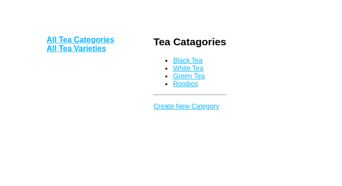
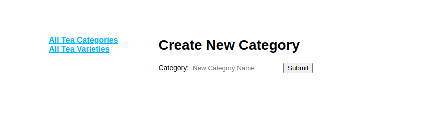
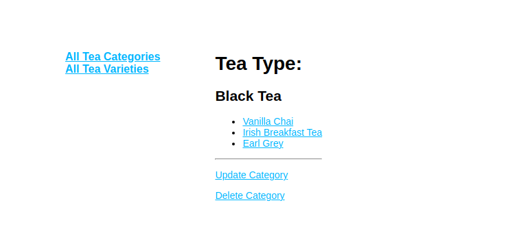
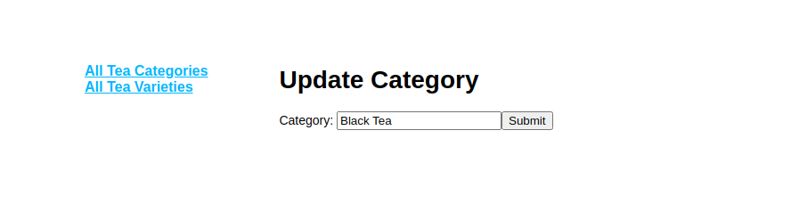
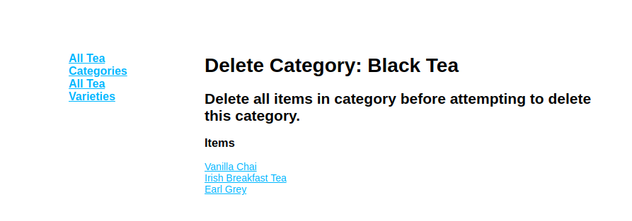
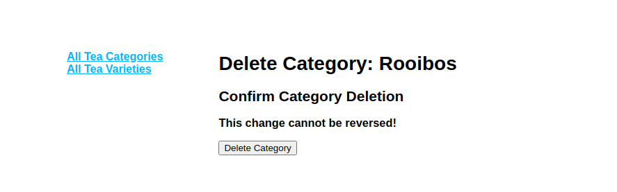
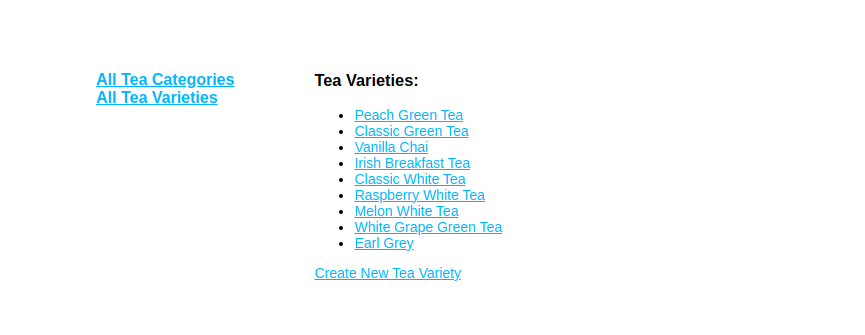
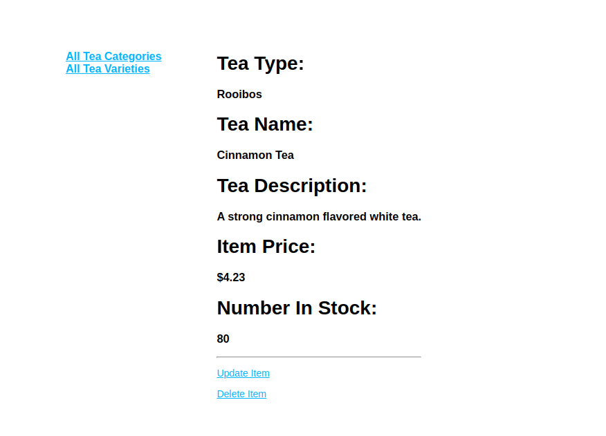
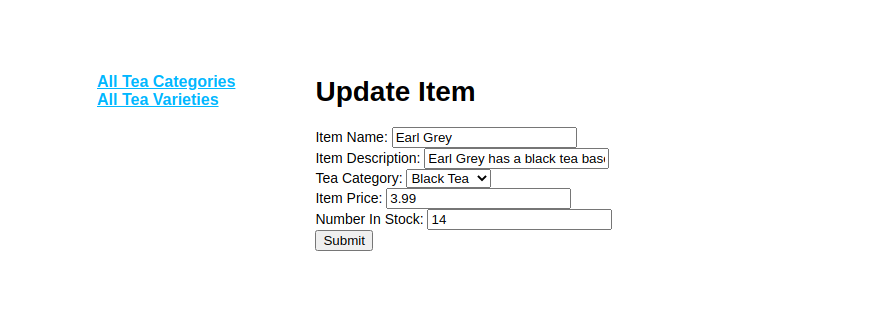
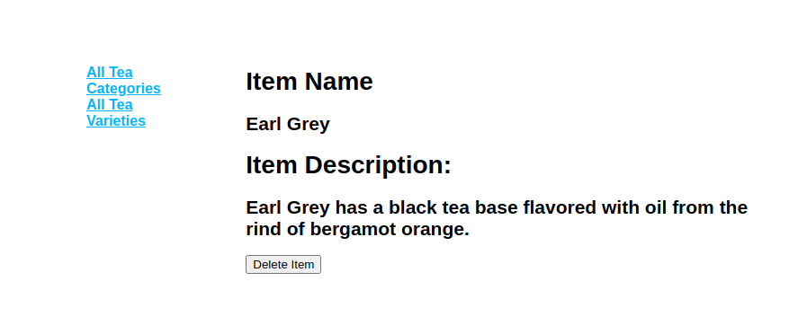

**Objective**

To create a back-end inventory site with Express, MongoDB, Mongoose, and Pug.

**Features**

All pages show the sidebar that links to the All Tea Categories (the load in page) and All Tea Varieties. These links will take the user back to the main list page for category or items.

The inventory site has a homepage, that on load in will display the tea categories that have inventory. These categories are populated from the database. The categories are clickable links that route to each tea categories' details. 

Tea Categories List Page (load in page):

Users can also create a new category using the link on the category list page too. The link will route to a form that can be filled out and on submit the new category is listed in the tea categories list. The user is routed to the item detail page for the new category on submit.

Create New Category Page:

Once a tea category is clicked on from the tea category list, users are routed to the category detail page. On this page users will see the list of tea items available under the category. 

On the tea category detail page, users can update the category if they choose to change the category name. The category name will populate in the form to be adjusted. Once the user clicks submit, after changes are made, they are routed back to the tea category detail page to view the updated list of teas in the category.

The tea category detail page also has a delete category button. The category can only be deleted if there are no tea variteties listed in the category. The user will be prompted to delete the tea items within the category before being able to delete the category.

Once the tea items are deleted the user will have the option to delete the category. After deleting the category the user is routed back to the original category list (load in page).

Users can access tea item details from the tea category list that accesses their tea type or from the All Tea Varieties list in the sidebar.

Once on the tea item detail page, the user will see more data populated from the database. The tea type, name, description, price, and number in stock are visible on the tea item detail page.

The tea item detail page also has an update item link. From this link users can update any detail about the item that is populated on the item detail page. Once they have updated the information and hit submit they are routed back to the tea item detail page to view the changes.

The tea item detail page also has a delete button which allows the user to delete a tea item. After a tea item is deleted the user is routed back to the All Tea Varieties page.

